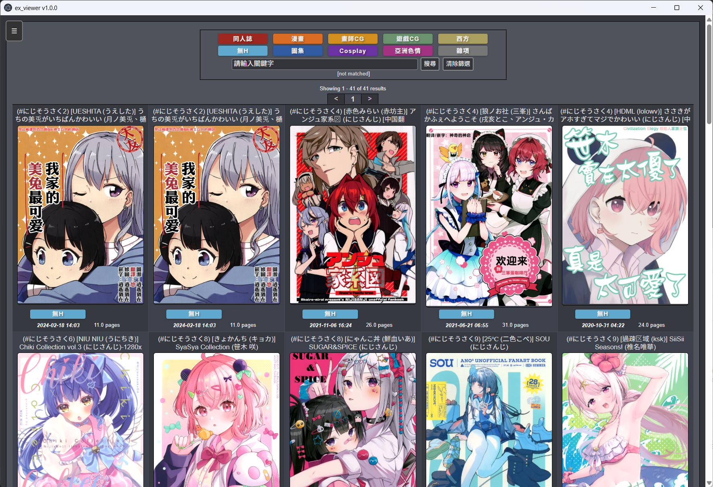
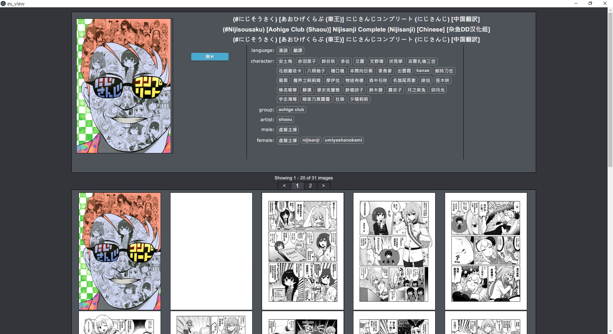

# ex_viewer

## 介紹

`ex_viewer` 是一個本本管理軟體，其想法類似 [Hentai Ark](https://www.ptt.cc/bbs/AC_In/M.1569436760.A.261.html)。
會利用從 EX 上獲取的 metadata 來**自動**將本機上的本本做整理，並提供類似 exhentai 界面的方式來使用。
與 Hentai Ark 不同的地方在於，我的程式更加注重瀏覽，可以在看本時利用快捷鍵快速切換上下本。
瀏覽方式類似 [HoneyView](https://tw.bandisoft.com/honeyview/)，並增加了名稱排序、隨機排序、歷史排序等方式，防止在本本資料庫中都是看到那幾本。

使用 Electron 開發，提供跨平台的相容性以及圖片高效顯示。


**本程式有版權疑慮，主要是UI、示例圖片，未來可能因此設為私人**

## 目錄

- [ex\_viewer](#ex_viewer)
  - [介紹](#介紹)
  - [目錄](#目錄)
  - [新版特色 (v1.0.0)](#新版特色-v100)
  - [下載＆安裝](#下載安裝)
    - [Windows 安裝](#windows-安裝)
    - [編譯安裝](#編譯安裝)
  - [使用說明](#使用說明)
    - [匹配畫面](#匹配畫面)
    - [主畫面](#主畫面)
    - [本子畫面](#本子畫面)
    - [瀏覽畫面](#瀏覽畫面)
      - [單圖瀏覽](#單圖瀏覽)
      - [整頁瀏覽](#整頁瀏覽)
    - [設定](#設定)
  - [特性與設定](#特性與設定)
    - [快取](#快取)
    - [本本排序方式](#本本排序方式)
    - [UI 語言分離](#ui-語言分離)
    - [本機資料庫與路徑](#本機資料庫與路徑)
    - [壓縮檔支援](#壓縮檔支援)
  - [授權與免責聲明](#授權與免責聲明)
  - [Thanks](#thanks)

## 新版特色 (v1.0.0)

- **全新設定頁面**：加入圖形化設定介面，不再需要手動修改 JSON 檔案。
- **多語言支援**：內建「臺灣正體」、「簡體中文」與「English」三種介面與標籤翻譯。
- **壓縮檔支援**：支援 `zip` 與 `cbz` 格式的本本。
- **瀏覽體驗升級**：加入直向瀏覽模式。
- **側邊欄與歷史紀錄**：主畫面加入側邊欄，支援歷史紀錄與釘選功能，並支援搜尋歷史翻譯標籤。
- **更強大的搜尋**：支援 Ehentai 搜尋語法。
- **右鍵選單增強**：加入右鍵排序選項與更多快捷操作。

## 下載＆安裝

Windows 使用者可以使用我編譯好的執行檔安裝即可，其他作業系統使用者可以使用原始碼編譯安裝。

### Windows 安裝

從 [GitHub Releases](https://github.com/hwei115j/ex_viewer/releases/latest) 下載並解壓縮，再從 [exhentai_metadata](https://github.com/hwei115j/exhentai_metadata/releases) 下載 `ex.7z`。
首先先將兩個壓縮檔分別解壓縮，會得到 `ex_viewer` 和 `ex.db`，再把 `ex.db` 放到 `ex_viewer/setting` 資料夾中。
最後按下 `ex_viewer` 就能開始程式了。

### 編譯安裝

首先先安裝 [node.js](https://nodejs.org/)，輸入以下指令開始編譯：

```bash
git clone https://github.com/hwei115j/ex_viewer
npm install
npm run dist # 打包成執行檔
```

產生可執行檔案，再從 [exhentai_metadata](https://github.com/hwei115j/exhentai_metadata/releases) 下載 `ex.7z` 解壓縮，把 `ex.db` 放到 `ex_viewer/setting` 資料夾中。
經測試可以在 ubuntu 上正常運作。

## 使用說明

程式分為以下幾個頁面：

- 匹配畫面
- 主畫面
- 本子畫面
- 瀏覽畫面
  - Naive Viewer：單圖瀏覽
  - Scroll Viewer：直向整頁瀏覽
- 設定

### 匹配畫面

當第一次打開程式時，會進入匹配畫面，選擇存放本本的資料夾，它會自動搜尋底下所有的本本。
本本的定義為：裡面沒有其他資料夾且裡面有圖片的資料夾，以及裡面有圖片的 zip/cbz 檔案。

資料夾格式：資料夾本身直接包含圖片檔。

```text
book-folder/
  001.jpg
  002.jpg
  003.jpg
```

壓縮檔格式：`zip` 或 `cbz` 內含圖片即可。

```text
book.zip
  001.jpg
  002.jpg
  003.jpg
```

選擇根目錄後可設定搜尋深度，1 代表「根目錄下直接是本子」，2 代表「根目錄下還有一層資料夾」，依此類推。


### 主畫面

其中有匹配到的本本，在圖片的下方會顯示對應的分類、日期（ex 上傳日期）、圖片頁數（ex 圖片頁數），未匹配到的本本則會全部顯示 null，而按下圖片則會進入本子畫面。



- **側邊欄**：提供歷史紀錄與釘選功能。
- **搜尋**：支援與 `exhentai` 搜尋相同的搜尋語法。上方分類欄也與與 `exhentai` 一致，按下為排除對應分類，全部按下則與全部不按相同。
- **右鍵選單**：提供排序、打開資料夾等功能。

鍵盤功能（可在設定中修改）：

- `esc`：關閉程式
- `enter`：全螢幕
- `<-`：上一頁
- `->`：下一頁

### 本子畫面

本子畫面如下：



如果未匹配到則會是：


標題第一欄是本機本子名，第二欄是 ex 上的原文名稱，第三欄則是 ex 上的羅馬字名稱。
中間是 tag，按下則會顯示藍色，並在側邊顯示 tag 的解釋（如果有的話），按下下方的 `搜尋`，則會跳回主畫面並搜尋所有選擇（藍色）的 tag。
需要注意的是，解釋只會顯示最後按下的 tag，如果有想要看解釋的藍色 tag，那要先把取消藍色，再按一次就能看解釋了（按兩次就對了）。

鍵盤功能（可在設定中修改）：

- `esc`：關閉程式
- `enter`：全螢幕
- `backspace`：退回主畫面
- `<-`：上一頁
- `->`：下一頁
- `ctrl + <-`、`[`：上一本
- `ctrl + ->`、`]`：下一本
- `0`：排序（可以在隨機排序與照本子名排序中切換）

### 瀏覽畫面

瀏覽畫面分為 **單圖瀏覽** 與 **整頁瀏覽** 兩種模式，可在設定中切換。

#### 單圖瀏覽


使用滾輪可以切換上下頁，當在第一頁時，左上角會短暫顯示「第一頁」。

鍵盤功能（可在設定中修改）：

- `esc`：關閉程式
- `enter`：全螢幕
- `backspace`：退回本子畫面
- `+`：放大
- `-`：縮小
- `/`：回復預設大小
- `home`：第一頁
- `end`：最尾頁
- `<-`、`pageup`：上一頁
- `->`、`pagedown`：下一頁
- `ctrl + <-`、`[`：上一本
- `ctrl + ->`、`]`：下一本
- `0`：排序（可以在隨機排序與照本子名排序中切換）

#### 整頁瀏覽


### 設定

v1.0.0 導入了全新的圖形化設定頁面，取代了過去手動修改 JSON 的方式。
在設定頁面中，你可以：

- 自訂鍵盤快捷鍵。
- 切換 UI 語言（臺灣正體、簡體中文、English）。
- 調整快取數量。
- 執行 Rematch（重新匹配），無需手動刪除 `local.db`。
- 開啟/關閉本機資料庫更新。
- 開啟/關閉搜尋歷史翻譯標籤。

## 特性與設定

### 快取

由於使用技術的限制，圖片的載入速度稍慢，所以設計了快取機制，同時載入多張圖片，以降低快速切換圖片造成的延遲（但解析度太大的圖片還是愛莫能助）。
可以根據需求在設定中調整，但要注意效能瓶頸在於硬碟讀取速度，隨意加大反而會讓效能降低。

### 本本排序方式

在瀏覽本本的時候，防止固定順序造成審美疲勞。
按下「數字鍵 0」、或是「右鍵排序」便可以切換「名稱排序」、「隨機排序」、「時間排序」。
時間排序基於 Matedata。
如果是在「瀏覽畫面」中切換排序，左上角會短暫出現提示。


### UI 語言分離

支援「臺灣正體」、「簡體中文」與「English」三種語言。UI 翻譯與標籤定義檔放置於 `setting/language` 目錄下，可透過設定頁面切換。

### 本機資料庫與路徑

為了隔離使用者資料，v1.0.0 調整了檔案結構，所有的使用者資料與資料庫皆存放在 `setting/local` 中：

```text
setting/
├── default_setting.json (預設設定檔)
├── ex.db (ex metadata)
├── language/
│   ├── definition_zh-CN.json
│   ├── definition_zh-TW.json
│   ├── ui_zh-CN.json
│   ├── ui_zh-TW.json
│   └── LICENSE.md
└── local/ (使用者資料區)
    ├── dir.json (存放需要 update 的路徑)
    ├── historyList.json (歷史紀錄)
    ├── local.db (存放匹配過的本子資料)
    └── setting.json (使用者設定)
```

當找不到 `setting.json` 時，程式會自動從 `default_setting.json` 複製一份。

### 壓縮檔支援

支援 `zip` 與 `cbz` 格式的本本，並透過原生的機制進行讀取與解析。

## 授權與免責聲明

本專案包含第三方翻譯資料，位於 `setting/language`。
該部分資料來源於 [EhTagTranslation](https://github.com/EhTagTranslation/Database)，依其原始授權條款提供。

除另有註明外，本專案原始程式碼採 MIT License。
軟體按「現狀」提供，不附帶任何形式的明示或暗示保證。作者不對使用本軟體所造成的任何資料遺失或損壞負責。

佛系更新，不要期待有新功能......

## Thanks

這個程式使用 `nodejs` + `eletron` 開發、`electron-builder` 完成分發。
照抄 `exhentai.org` 的 HTML 與 CSS。
中文翻譯使用了 [EhTagTranslation](https://github.com/EhTagTranslation/Database) 的成果，其 LICENSE 位於 `setting/language/LICENSE.md`。

使用了以下套件：

- [dialogs](https://github.com/jameskyburz/dialogs)
- [fast-levenshtein](https://github.com/hiddentao/fast-levenshtein)
- [jszip-sync](https://github.com/ericvergnaud/jszip)
- [node-stream-zip](https://github.com/antelle/node-stream-zip)
- [viewerjs](https://github.com/fengyuanchen/viewerjs)
- [electron](https://github.com/electron/electron)
- [electron-builder](https://github.com/electron-userland/electron-builder)
